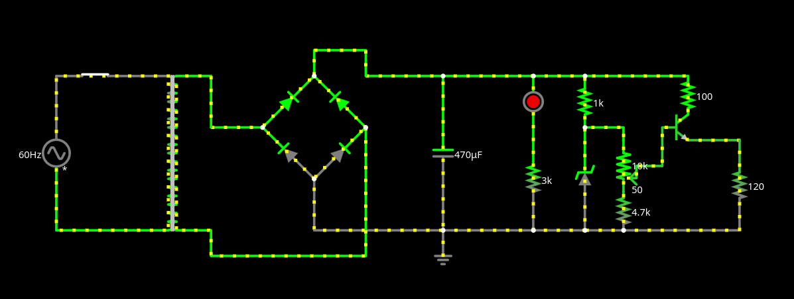
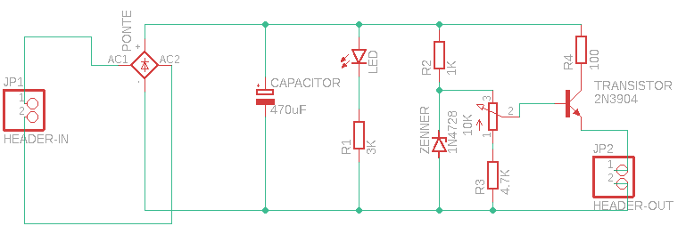
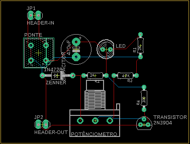
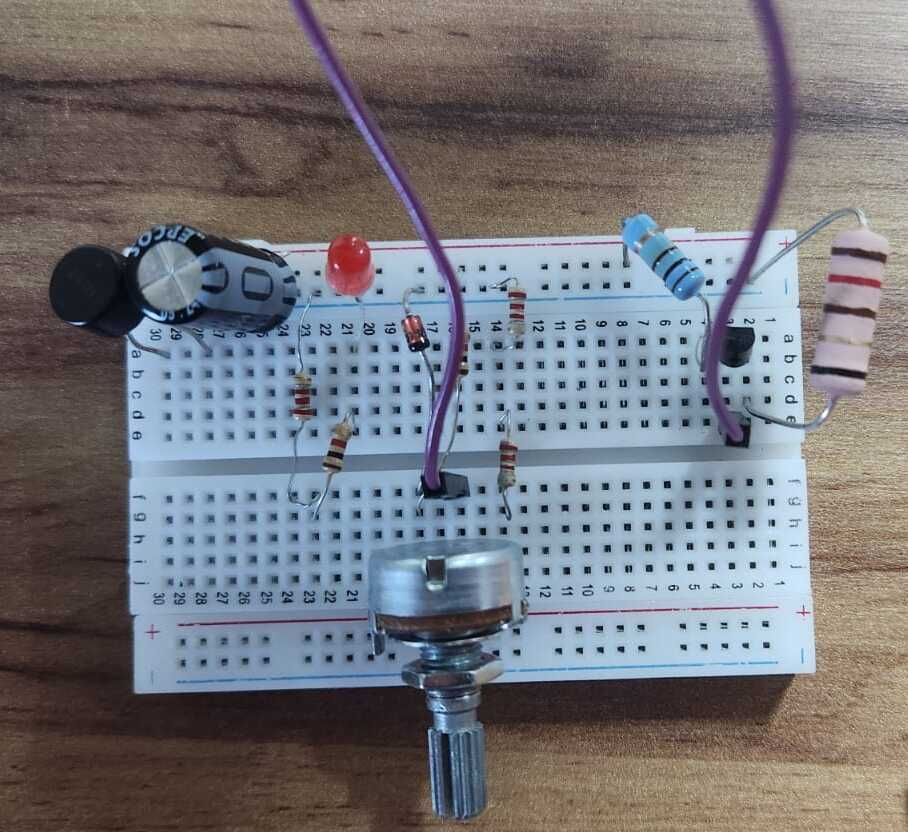
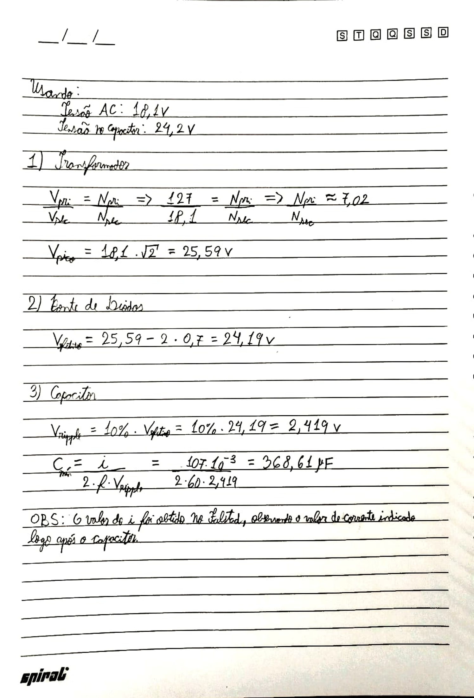
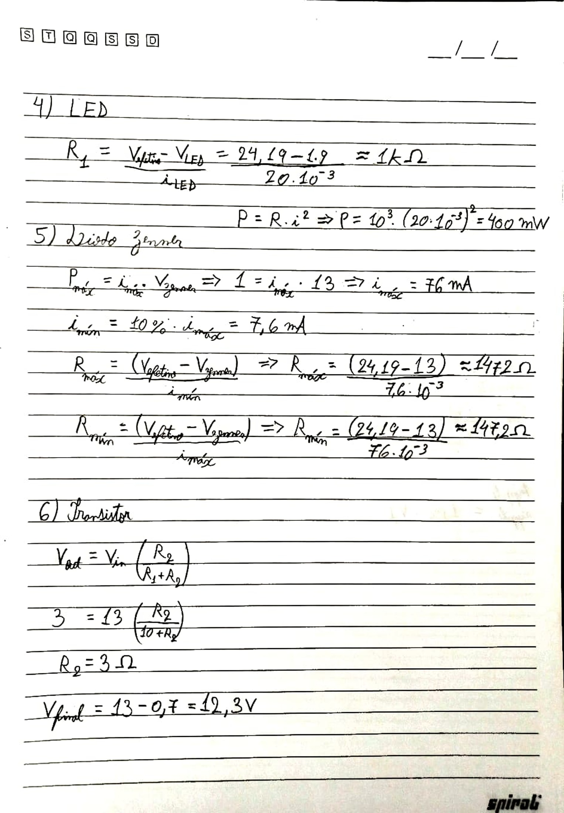

# Fonte de Tensão Variável

## Integrantes do Grupo
- Felipe Ferreira Colona - 15636525
- Arthur Martins Pereira - 16855601
- Gabriel Cordeiro Correa Silva - 16866642

## Descrição
O projeto se trata de uma fonte de tensão variável que, ao receber uma corrente alternada (AC), fornece uma corrente direta aproximadamente contínua (DC). Nesse contexto, deve ser possível regular a tensão de saída por meio de um potenciômetro, podendo escolher entre 3V e 12V e mantendo uma corrente de cerca de 100mA. Desse modo, a fonte deve ser capaz de carregar um celular sem causar danos.

## Componentes

| Quantidade      | Componente              | Valor    |
| --------------- | ----------------------- | -------  |
| 1x              | Ponte de diodos         | R$ 3,90  |
| 1x              | Capacitor               | R$ 4,40  |
| 1x              | Potenciômetro           | R$ 7,00  |
| 1x              | Diodo Zenner            | R$ 0,50  |
| 1x              | Transistor 2N2222       | R$ 2,55  |
| 5x              | Resistores 1/4W         | R$ 0,07  |
| 1x              | Resistor 2W             | R$ 1,20  |
| 1x              | LED                     | R$ 0,50  |
| 1x              | Jumper                  | R$ 0,70  |
| 1x              | Protoboard              | R$ 21,70 |
| TOTAL           |                         | R$ 42,80 |

#### Transformador
O transformador é responsável por diminuir o pico da tensão recebida da tomada de 180V para 18,1V. Essa transformação ocorre por meio da variação do campo magnético nas espiras do componente que causa uma indução de corrente elétrica.

#### Ponte de Diodo
A ponte de diodo é responsável por garantir que a corrente flua em somente um sentido ao longo do circuito. Isso é necessário, pois a tensão de entrada é uma senoide e, desse modo, possui uma parte negativa. Sendo assim, a ponte é composta por 4 diodos que, da forma em que estão dispostos, permitem a passagem de corrente em apenas um sentido.

#### Capacitor
O capacitor é responsável por continuar a fornecer tensão ao circuito mesmo nos mementos em que a senoide da tensão está com uma taxa de variação negativa, isto é, está diminuindo. Nesse sentido, o componente armazena carga quando a tensão está alta e libera carga quando a tensão de fora está menor do que a tensão do capacitor.

#### Resistor
O resistor é responsável por diminuir a corrente elétrica que chega a um outro componente. Isso é feito a fim de não ultrapassar a potência de operação do componente em questão e mantê-lo funcionando.

#### LED
O LED é responsável por facilitar a visualização do comportamento do circuito. Nesse sentido, o intuito é que ele se mantenha aceso durante todo o período. Assim, indicando que a corrente está de fato contínua (aproximadamente).

#### Diodo Zenner
O diodo zenner é reponsável por limitar a tensão máxima. No circuito em questão, ele limita a tensão em 13V que, após passar passar pelo transistor, se torna 12,3V.

#### Transistor
O transistor é responsável por amplificar o sinal que chega nele, de modo a fornecer 100 mA de corrente ao final do circuito.

#### Potenciômetro
O potenciômetro é responsável por possibilitar regular a tensão de saída (entre 3V e 12V).

## Circuito

[Link para o circuito](https://www.falstad.com/circuit/circuitjs.html?ctz=CQAgjCAMB0l3BWcMBMcUHYMGZIA4UA2ATmIxAUgpABZsKBTAWjDACgAnEQlG27FN1608VKmDhsA5iAFUefOdwSEoUThRp8EGVQi1C+VGhkkB3TdrCD9fGsVWQ2F+6teXaD9S68L+gvydsPgAvADcAewAbABcAQykGAB0ARzB6cWgMMDoEFDwwYnz8PDxsZnIqQXT1EM9VP3d3QXDo+MTU9OdDf3repy4mgT73cXhuhCK+yZsDJxdhukEhwXmKKdsKQipNpzAMbQMEaw8dVQgJeChoUkp4e-uIACUGAGcAS1f4gDsAYwYJgZGr5hGtCKUeptAt0-McAhC4eoYutliC7F5xCAWBhoPo8LoaAhcIRCMETjBCLpKXhiJB9qIDthyJcQAATBgAMziAFdYt0mF4lljCHZhmsWPleixtv02K8sdY8FLBWK1Fyoq8AQtlsMlEK1kK-EpoYNFiqAqDZOMwDxekL7V5BOyubyYkwogxWeA1GJYOwLMbhChhNCLMHRYI9WK2L9ZGheoG7Nd4CYQChsNBsDb0lpeKxCcFk3T1FxwUrEWWeuI0PybfJhEwRVW2GEFTKhdL60ZvTKwKIfdcEGwACrCiNxqu0a7pUqzudz4hYmCQGgoImQbaUyh9umLpgIG4YPAISjEfGbmjg5g5a6kYjdQVeM2Obp1lHgGUqMSv9vDN80OB1C9N8vzTYRmnAAA5ACVzYYDPxlR9VGqaC4BoOCwPRc5f0EFCYPQr0kI-YxhjwtCfx2KY31DYienDZsw3Ax0QxUbxMOUVRhkIVi1i41iuNBbpFl1VEXwsf9APomC2KkyTwOjCJ+G4bsANIWhMkcNMlOwNhFPjJtjEgNSAOuaotPjHTFIaFSjMXeNl2sJBcO4WQ2CAA)

## Design de PCB

## Imagem e Vídeo

## Cálculos

